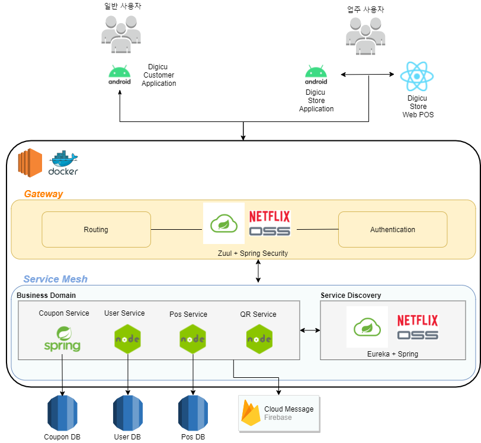

    <h3>Digicu</h3>
	

        편리한 쿠폰 통합 관리 서비스
    

    

        <a href="https://github.com/lets-get-a-job/digicu-pos">웹 POS 서비스</a>
    

     

        <a href="https://github.com/lets-get-a-job/digicu_customer">일반 고객 애플리케이션</a>
    

    

        <a href="https://github.com/lets-get-a-job/digicu_shop">QR 코드 리더 애플리케이션</a>
    

## Table of Contents

1. [Description](#Description)
2. [Technical Overview](#Technical-Overview)
3. [Preinstallation](#Preinstallation)
4. [API specification](#API-Document)

## Description

오프라인 매장에서 발급되는 종이 쿠폰은 훼손되어 버려지거나 분실되는 경우가 많습니다.  
또한, 매장마다 쿠폰을 따로 관리하기 때문에 이를 관리해야 하는 고객이나 가게 입장에서 불편함이 있습니다.  
디지쿠는 그러한 문제점을 해결하고자 통합된 쿠폰관리 서비스를 제공합니다.

## Technical Overview

### Architecture

## Preinstallation

- docker
- docker-compose

## API Document 

- 유저/인증 API :  https://app.swaggerhub.com/apis/lets-get-a-job/user-service/1.0.0
- POS API : https://app.swaggerhub.com/apis/lets-get-a-job/pos_service/1.0
- 쿠폰 API : https://app.swaggerhub.com/apis/digicu/coupon_service/1.0.0

